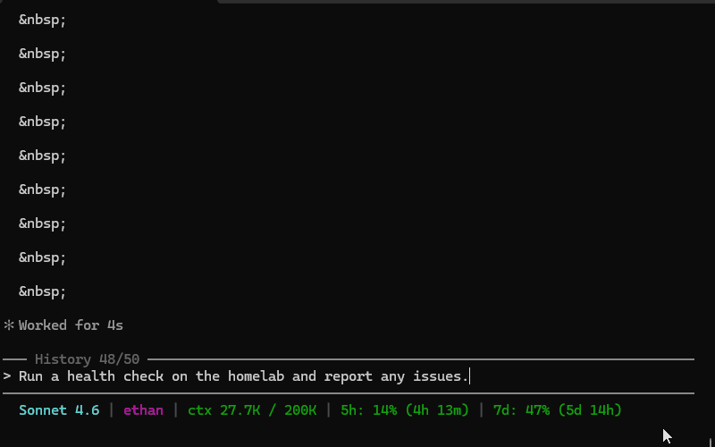

# homelab-mcp-server

A stdio [Model Context Protocol](https://modelcontextprotocol.io) server that connects Claude Code on Windows to a Proxmox VE node over the REST API and SSH. Exposes a tier-gated operator toolkit ranging from read-only observability to full host access, with least privilege enforced by default.

*Designed by a human through a documented architecture-first process. Implemented by Claude against those specifications. See [Design process](#design-process).*



## Why this exists

Managing a homelab has always meant SSH sessions full of the same ceremony: `ls` your way to the right directory, `cat` the config to understand what's there, open `nano` to make a two-line change, `echo` something into a file you could've just edited directly. Every task requires you to be the relay — gathering context, executing instructions, pasting output back, iterating.

**From the operator's perspective**, the immediate improvement is that the relay role mostly disappears. You describe what you want done. The tools handle the context-gathering, the execution, and the verification. The filesystem crawling and nano sessions that used to fill an SSH session are replaced by a single conversation turn.

**From the AI's perspective**, the improvement is precision. Without tools, suggesting a config change means giving instructions that might be applied to the wrong file, typed incorrectly, or made without knowing what was already there. With tools, the read-before-write cycle is automatic: check the current state, make the targeted change, read it back to confirm. Tasks that used to require ten back-and-forth exchanges — "run this, paste the output, now try this" — collapse into one. The feedback loop that makes useful assistance possible closes entirely on the AI side rather than depending on the operator to close it manually.

**The tier model addresses the trust side of this.** Giving an AI assistant access to a production-ish server is a reasonable thing to be cautious about. The answer isn't to refuse the capability — it's to calibrate it. Start at `observe`, where Proxmox itself enforces the limits and no software bug or misbehaving prompt can exceed the token's privileges. Escalate to `companion` only when you need it. The audit log records every write regardless of tier, and the backup pipeline makes every change reversible. The design invites you to trust incrementally rather than all at once.

## Tier model

The server runs at one of four tiers. Choose the lowest tier that covers what you need.

| Tier | Credentials | Enforced by | What it adds |
|------|-------------|-------------|--------------|
| **observe** *(default)* | API token (PVEAuditor role) | **Proxmox RBAC** | Read-only tools |
| **operate** | API token (MCPOperate role) | **Proxmox RBAC** | Guest start / stop / restart |
| **companion** | + root SSH key | **MCP server** | In-guest exec, file I/O, snapshots, log tailing, config history |
| **root** | + acknowledgment flag | **MCP server** | Host shell, host file read/write |

`observe` and `operate` are enforced by Proxmox itself — a bug or injected prompt cannot exceed the token's privileges. `companion` and above are enforced by the MCP server's guardrails (registration filtering + denylist + confirm gate), which are tripwires rather than a sandbox.

## Tools

### observe

| Tool | Description |
|------|-------------|
| `describe_homelab` | Secret-redacted census of the node: guests, storage, network, services, Tailscale |
| `health_check` | Fixed-probe node health → ok / warn / crit per section (node, storage, guests, units, updates) |
| `pct_list` | List LXC containers and status |
| `qm_list` | List QEMU/KVM VMs and status |
| `query_audit` | Filter and summarize the local audit log |

### operate *(adds to observe)*

| Tool | Description |
|------|-------------|
| `guest_start` | Start a VM or container |
| `guest_stop` | Stop a VM or container (confirm-gated) |
| `guest_restart` | Restart a VM or container |

### companion *(adds to operate)*

| Tool | Description |
|------|-------------|
| `pct_exec` | Run a command inside an LXC container |
| `pct_read_file` / `pct_write_file` | Container file I/O via `pct pull` / `pct push` |
| `qm_agent_ping` | Check a VM's QEMU guest agent responsiveness |
| `qm_exec` | Run a command in a VM via the guest agent |
| `qm_read_file` / `qm_write_file` | VM file I/O via the guest agent |
| `tail_log` | Bounded, always-redacted journal or file tail (host or container) |
| `diff_config` | Preview a revert: current → backup diff |
| `revert_file` / `list_backups` | Restore a file from a local backup; list versions |
| `snapshot_create` / `snapshot_list` / `snapshot_rollback` / `snapshot_delete` | Server-managed (`mcp-`) guest snapshots |
| `config_sweep` | Hash-compare sweep of watched paths into a local git mirror; captures out-of-band edits |

### root *(adds to companion)*

| Tool | Description |
|------|-------------|
| `execute` | Run a shell command on the Proxmox host |
| `read_file` | Read a file from the host filesystem (stat-gated, windowed) |
| `write_file` | Write a file on the host — full backup pipeline + audit on every write |
| `list_directory` | List a host directory |

## Setup

**Prerequisites:** Node.js 20+, Claude Code, PowerShell 5.1+ (Windows), a Proxmox VE node on the same LAN.

```powershell
git clone https://github.com/ethanblauw21/homelab-mcp-server
cd homelab-mcp-server
npm install && npm run build
.\scripts\setup.ps1
```

The setup script walks you through the ceremony interactively — choose a tier, enter your node's address, pick a bootstrap mode:

- **auto** — one SSH root password prompt, then fully automated
- **paste** — prints a script to run in the Proxmox web shell (no root password touches your machine)

The ceremony then:

1. Provisions `mcp@pve` with a tier-appropriate token on the node *(idempotent — re-running changes the tier)*
2. Captures both trust anchors: the API TLS certificate fingerprint and *(at companion)* the SSH host key fingerprint
3. Runs a 403 negative test to confirm privilege separation is actually enforcing, not just configured
4. Calls `claude mcp add` to register the `homelab` server with Claude Code

Restart Claude Code when it completes.

All parameters can also be passed as flags for automated or repeated runs:

```powershell
.\scripts\setup.ps1 -Tier observe   -NodeHost 192.168.1.100
.\scripts\setup.ps1 -Tier companion -NodeHost 192.168.1.100 -BootstrapMode paste
.\scripts\setup.ps1 -Tier observe   -NodeHost 192.168.1.100 -DryRun
```

### Upgrading tiers

Re-run `.\scripts\setup.ps1` at the new tier — setup is idempotent. Downgrading from `companion` removes the SSH key from `authorized_keys` and deletes the local private key.

### Root tier

Root is not selectable from the setup script by design. After a `companion` install, opt in by setting this exact env var in the registered MCP server configuration and restarting Claude Code:

```
MCP_HOST_ROOT_ENABLED=I-understand-Claude-gets-root-and-can-break-this-node
```

Any other value (including `true`) is treated as disabled. There is no runtime escalation path.

## Architecture

The server uses a pure-core, injected-I/O design: guardrails, backup policy, audit record construction, and tier registry are all pure functions. Tool handlers depend on injected `SshTransport` and `NodeOps` interfaces and never touch the concrete SSH or HTTP clients directly. The API backend runs at every tier; the SSH backend handles companion+ operations. Both implement the same interface — the transport follows the tool, not the tier.

See [ARCHITECTURE.md](ARCHITECTURE.md) for the full design: hybrid transport, trust model, backup pipeline, audit log, config history, guardrails, and source layout.

## Development

```bash
npm run build       # tsc compile
npm run dev         # tsx watch
npm test            # all tests
npm run test:unit   # unit tests only (fast, no Docker required)
npm run test:int    # integration tests (requires Docker — Linux/CI only)
npm run lint
npm run typecheck
```

Integration tests spin up a Dockerized SSH container automatically and are skipped gracefully if Docker is absent. On Windows, unit tests are the local feedback loop.

See [CONTRIBUTING.md](CONTRIBUTING.md) for the ADR-first process, testing requirements, and what contributions are welcome.

## Storage

All persistent data lives on the **Windows host**, not the Proxmox node:

| Data | Default location |
|------|-----------------|
| Backups | `%LOCALAPPDATA%\claude-mcp\backups\` |
| Audit log | `%LOCALAPPDATA%\claude-mcp\audit.jsonl` |
| Config history | `%LOCALAPPDATA%\claude-mcp\config-history\` |

Point `MCP_BACKUP_DIR` at a synced folder or NAS for extra durability.

## Security

The tier model is the primary defense: `observe` and `operate` are enforced by Proxmox RBAC, so no bug or injected prompt can exceed the token's privileges. At `companion` and above, the MCP server's guardrails take over — denylist, confirm gate, protected set, pinned trust, and an immutable audit trail.

See [SECURITY.md](SECURITY.md) for the full threat model, each layer of defense, and root tier guidance.

## Design process

This project was built architecture-first. The design was specified through seven Architecture Decision Records before implementation began. Each ADR documents the decisions, constraints, and rationale for a slice of the system — the code was written to satisfy the spec, not the other way around.

| ADR | Scope |
|-----|-------|
| ADR-001 | SSH transport, initial tool surface, guardrails, testing strategy |
| ADR-002 | Census tool: redaction, drift detection, tier-aware sections |
| ADR-003 | Container file I/O, backup pipeline, snapshot guard |
| ADR-004 | Transport hardening: pinned trust, timeout enforcement, denylist, audit |
| ADR-005 | VM parity: `qm_*` tools, health check, log tailing, audit forensics |
| ADR-006 | Git-backed config history: mutation commits, config sweep, push modes |
| ADR-007 | Permission tiers, hybrid transport, root flag, protected set |

The ADRs are the authoritative specification — `CLAUDE.md` and the testing strategy reference them, not the reverse. The tier model, trust model, backup pipeline design, and guardrail architecture were all reasoned through in writing before a line of implementation existed.

**Ethan** designed and architected the system. **Claude** implemented the code against those specifications. The co-author attribution on commits reflects who wrote the implementation; the ADR corpus reflects who made the design decisions. These are different contributions, and the distinction is intentional.

See [ROADMAP.md](ROADMAP.md) for planned work and known deferred items from the ADR series.
